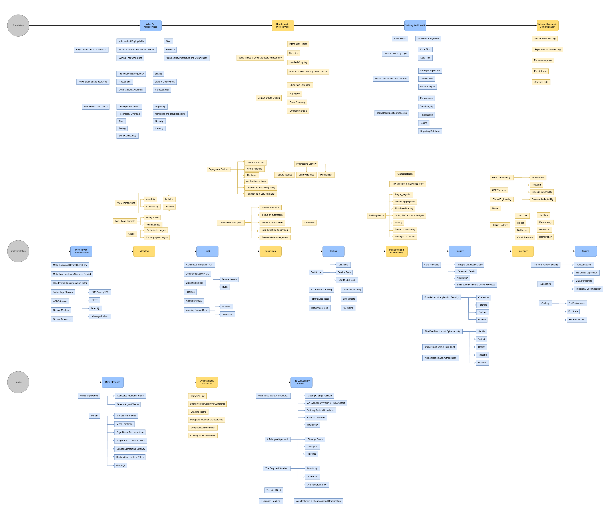
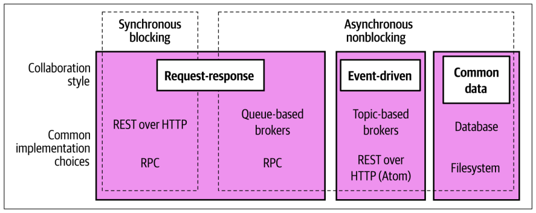
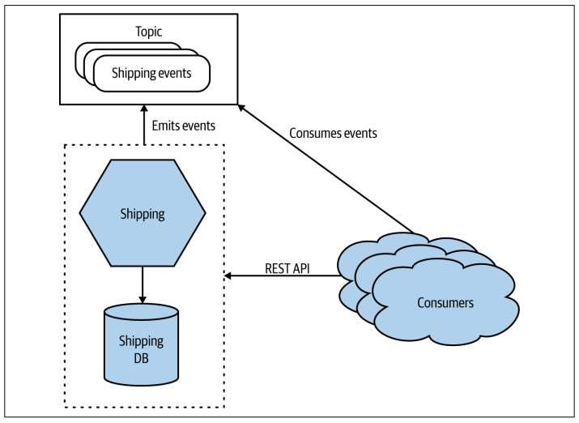

## Building Microservices

After completing the Building Microservices book, I was inspired to create a comprehensive summary that encapsulates all of the essential points. Without further ado, here it is.

### Book Diagram

### What Are Microservices?

As introduced in Chapter 1, microservices are a type of service-oriented architecture that focuses on independent deployability. Independent deployability means that you can make a change to a microservice, deploy that microservice, and release its functionality to the end users without requiring other microservices to change. Getting the most out of a microservice architecture means embracing this concept. Normally, each microservice is deployed as a process, with communication with other microservices being done over some form of network protocol. It’s common to deploy multiple instances of a microservice, perhaps so that you can provide more scale, or else to improve robustness by having redundancy.

To deliver independent deployability, we need to make sure when changing one microservice that we don’t break interactions with other microservices. This requires that our interfaces with other microservices are stable, and that changes be made in a backward-compatible way. Information hiding, which I expanded on in Chapter 2, describes an approach in which as much information as possible (code, data) is hidden behind an interface. You should expose only the bare minimum over your service interfaces to satisfy your consumers. The less you expose, the easier it is to ensure the changes you make are going to be backward compatible. Information hiding also allows us to make technological changes within a microservice boundary in a way that won’t impact consumers.

One of the key ways we implement independent deployability is by hiding the database. If a microservice needs to store state in a database, this should be entirely hidden from the outside world. Internal databases should not be directly exposed to external consumers, as this causes too much coupling between the two, which undermines independent deployability. In general, avoid situations in which multiple microservices all access the same database.

Microservices work very well with domain-driven design (DDD). DDD gives us concepts that help us find our microservice boundaries, with the resulting architecture being aligned around the business domain. This is extremely helpful in situations where organizations are creating more business-centric IT teams. With a team focused on one part of the business domain, it can now take ownership of the microservices that match this part of the business.

### Moving to Microservices

Microservices bring a lot of complexity—enough complexity that the reasons for using them need to be seriously considered. I remain convinced that a simple single process monolith is a totally sensible starting point for a new system. Over time, though, we learn things, and we start to see the ways in which our current system architecture is no longer fit for purpose. At that point, looking to change is appropriate.

It is important to understand what you are trying to get out of a microservice architecture. What is the goal? What positive outcome do you expect a shift to microservices to bring? The outcome you are aiming for will directly impact how you break your monolith apart. If you are trying to change your system architecture to better handle scale, you’ll end up making different changes than if your main driver is to improve organizational autonomy. I cover this more in Chapter 3, and in even more detail in my book Monolith to Microservices.

Many of the problems with microservices are evident only after you hit production. Therefore, I strongly recommend an incremental, evolutionary decomposition of an existing monolith rather than a “big bang” rewrite. Identify a microservice you want to create, extract the appropriate functionality from the monolith, deploy the new microservice into production, and start using it in anger. Based on that, you’ll see if you are helping move toward your goal, but you’ll also learn a lot that will make the next microservice extraction easier—or perhaps it will suggest to you that microservices might not be the way forward after all!

### Communication Styles

We summarized the main forms of inter-microservice communication in Chapter 4, shared again in Figure A-1. This isn’t meant to be a universal model but is intended to just give an overview of the different types of communication that are most common.

_Figure A-1. Different styles of inter-microservice communication along with example
implementing technologies_

With request-response communication, a microservice sends a request to a downstream microservice and expects a response. With synchronous request-response, we would expect the response to come back to the microservice instance that sent the request. With asynchronous request-response, it’s possible for the response to come back to a different instance of the upstream microservices.

With event-driven communication, a microservice emits an event, and other microservices, if they are interested in that event, can react to it. Events are just statements of fact—information that is shared about something that has happened. With event driven communication, a microservice doesn’t tell another microservice what to do; it just shares events. It’s up to downstream microservices to make a judgment call as to what they do with that information. Event-driven communication is by definition asynchronous in nature.

One microservice may communicate over more than one protocol. For example, in Figure A-2 we see a Shipping microservice providing a REST interface for request
response interaction, which also fires events when changes are made.

_Figure A-2. A microservice exposing its functionality over a REST API and a topic_

Event-driven collaboration can make it easier to build more loosely coupled architectures, but it can require more work to understand how the system is behaving. This type of communication also often requires the use of specialist technology such as message brokers, which can further complicate matters. If you can use a fully managed message broker, that can help lower the cost of these types of systems.

Request-response and event-driven interaction models both have their place, and often which one you use will be a personal preference. Some problems just fit one model more than another, and it’s common for a microservice architecture to have a mix of styles.

### Workflow

When looking to get multiple microservices collaborating to perform some overarching operation, look to explicitly model the process using sagas, a topic we explored in Chapter 6.

In general, distributed transactions should be avoided in situations where you can use a saga instead. Distributed transactions add significant complexity to systems, have problematic failure modes, and often don’t deliver what you expect even when they work. Sagas are in virtually all cases a better fit for implementing business processes that span multiple microservices.

There are two different styles of sagas to consider: orchestrated sagas and choreographed sagas. Orchestrated sagas use a centralized orchestrator to coordinate with other microservices and ensure that things are done. In general, this is a simple and straightforward approach, but the central orchestrator can end up doing too much if you aren’t careful, and it can become a source of contention when multiple teams are working on the same business process. With choreographed sagas, there is no central coordinator; instead, the responsibility for the business process is distributed into a number of collaborating microservices. This can be a more complex architecture to implement, and it requires more work to ensure that the right things are happening, but on the flip side it is much less prone to coupling and works well for multiple teams.

Personally, I love choreographed sagas, but then I’ve used them a lot and made a lot of mistakes implementing them. My general advice is that orchestrated sagas work fine when a single team owns responsibility for the whole process, but they become more problematic with multiple teams. Choreographed sagas can justify their increased complexity in situations in which multiple teams are expected to collaborate on a process.

### Build

Each microservice should have its own build, its own CI pipeline. When I make a change to a microservice, I expect to be able to build that microservice by itself. Avoid situations in which you have to build all your microservices together, as this makes independent deployability much harder.

For reasons outlined in Chapter 7, I am not a fan of monorepos. If you really want to use them, then please understand the challenges they cause around clear lines of ownership and potential complexity of builds. But definitely make sure that, whether you use a monorepo or a multirepo approach, each microservice has its own CI build process that can be triggered independently of any other builds.

### Deployment

Microservices are normally deployed as a process. This process can be deployed onto a physical machine, a virtual machine, a container, or an FaaS platform. Ideally, we want microservices to be as isolated from one another as possible in a deployed environment. We don’t want a situation in which one microservice using up lots of computing resources can impact a different microservice. In general, this means we want to have each microservice using its own ring-fenced operating system and set of computing resources. Containers are especially effective at giving each microservice instance its own ring-fenced set of resources, making them a great choice for microservice deployments.

Kubernetes can be very useful if you are looking to run container workloads across multiple machines. It’s not something I’d recommend for just a few microservices, as it brings with it its own sources of complexity. Where possible, use a managed Kubernetes cluster, as this allows you to avoid some of this complexity.

FaaS is an interesting emerging pattern in deploying code. Rather than having to specify how many copies of something you want, you just give your code to the FaaS platform and say, “When this happens, run this code.” This is really nice from a developer point of view, and I think an abstraction like this is likely the future for a large amount of server-side development. The current implementations aren’t without problems, though. In terms of microservices, deploying a whole microservice as a single “function” on a FaaS platform is a totally fine way to start.

One final note: separate in your mind the concepts of deployment and release. Just because you’ve deployed something to production doesn’t mean it has to be released to your users. By separating these concepts, you open up the opportunity to roll out your software in different ways—for example, by using canary releases or parallel runs. All of this and more is covered in depth in Chapter 8.
